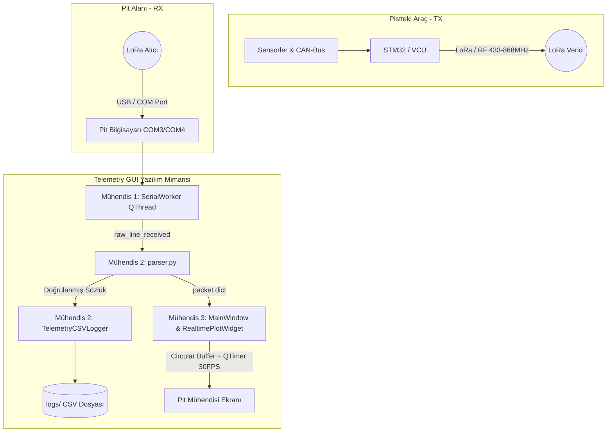

# Telemetry GUI — Yer İstasyonu Arayüzü

Pit alanındaki mühendislerin pistteki aracı canlı olarak takip etmesi için geliştirilen masaüstü telemetri programı. Raspberry Pi üzerinden LoRa ile gelen araç verisini (hız, sıcaklık vb.) seri port üzerinden okuyup gerçek zamanlı çizgi grafiklere döker.

## 3 Kişilik Ekip Görev Dağılımı, Sistem Mimarisi ve Çalışma Rehberi

Bu proje, yüksek frekanslı seri port okuması ile donma yaratmayan gerçek zamanlı grafik çizimini entegre ettiği için 3 kişilik bir ekip tarafından paralel olarak geliştirilebilir. Her mühendisin çalışma alanı ve dosyası çakışma (merge conflict) olmayacak şekilde ayrılmıştır:

```
Telemetry_GUI/
│
├── main.py                     # Uygulamayı başlatan tek giriş noktası (GUI'yi ve Worker'ı bağlar)
├── README.md                   # Kurulum, mimari ve geliştirme rehberi
├── requirements.txt            # PyQt5, pyqtgraph, pyserial, numpy
├── .gitignore                  # venv/, __pycache__/, logs/*.csv
│
├── core/                       # [Mühendis 1 ve Mühendis 2'nin Sorumluluk Alanı]
│   ├── __init__.py
│   ├── serial_worker.py        # 🧑‍💻 Mühendis 1: COM port bağlantısı ve QThread ile arka planda okuma
│   ├── simulator.py            # 🧑‍💻 Mühendis 1: Sahte telemetri verisi üreten test modülü (10 Hz)
│   ├── parser.py               # 🧑‍💻 Mühendis 2: Metin/Binary ayrıştırıcı, CRC ve sağlık metrikleri
│   └── logger.py               # 🧑‍💻 Mühendis 2: Zaman damgasıyla CSV/JSON dosyasına kaydetme
│
├── gui/                        # [Mühendis 3'ün Sorumluluk Alanı]
│   ├── __init__.py
│   ├── main_window.py          # Pit ekranı ana penceresi, rozetler, gauge'ler, menüler
│   ├── plot_widget.py          # 🧑‍💻 Mühendis 3: PyQtGraph ile donma yaratmayan canlı çizgi grafik
│   └── widgets/                # 🧑‍💻 Mühendis 3: Özel UI rozetleri ve göstergeler
│       ├── __init__.py
│       ├── badges.py           # AIR-, SDC vb. durum rozetleri ve arıza etiketleri
│       └── gauges.py           # Gaz ve fren basıncı için yarım daire iğneli göstergeler
│
├── assets/                     # Takım logoları, ikonlar ve QSS temaları
└── logs/                       # Yarış ve test sırasında oluşan telemetri CSV kayıtları (.gitkeep)
```

### Ekip Üyelerinin Görevleri ve Sorumlu Olduğu Dosyalar

| Mühendis | Sorumluluk Alanı | Sorumlu Olduğu Dosyalar | Temel Görevler ve Beklenen Sinyaller / Arayüzler |
|---|---|---|---|
| **🧑‍💻 Mühendis 1** | Seri Port, Arka Plan İletişimi & Simülatör | `core/serial_worker.py`<br>`core/simulator.py` | • COM portlarını listeleme (`serial.tools.list_ports`)<br>• Bloklayıcı okumayı `QThread` içinde yapmak (`SerialWorker`)<br>• ⭐ **Simülatör:** Donanım yokken saniyede 10 kere sahte telemetri verisi üreten test modu<br>• Sinyaller: `raw_line_received(str)`, `connection_status(bool, str)` |
| **🧑‍💻 Mühendis 2** | Veri Ayrıştırma, CRC & CSV Loglama | `core/parser.py`<br>`core/logger.py` | • Ham string (`parse_text_line`) veya binary paket (`parse_binary_packet`) çözme<br>• `seqNumber` takibi ile Paket Kayıp (%) ve Gecikme (`latencyMs`) hesaplama<br>• Gelen paketleri `logs/` altında tarih/saat damgalı CSV dosyasına yazma |
| **🧑‍💻 Mühendis 3** | Arayüz (UI/UX) & Canlı Grafik | `gui/main_window.py`<br>`gui/plot_widget.py`<br>`gui/widgets/` | • `PyQtGraph` + `collections.deque(maxlen=200)` ile 60 FPS akıcı grafik (`RealtimePlotWidget`)<br>• `QTimer` (30-33 ms) ile ayrık render (Decoupled Rendering)<br>• Pit ekranı rozetleri (`StatusBadge`) ve iğneli göstergeler (`HalfCircleGauge`) |

> **💡 Ekip İş Birliği Notu:** Arayüz tarafında görsel bileşen sayısı fazla olduğu için, **1. ve 2. Kişiler** kendi backend/parser modüllerini tamamladıklarında durum rozetlerinin (`AIR-`, `SDC` vb. yeşil/kırmızı göstergelerin) bağlanmasında **3. Kişiye** destek olacaktır.

### Sistem Mimarisi ve Veri Akışı




# FST-26 Pit Telemetri Veri Rehberi
 
Bu doküman, `telemetry.c` / `telemetry.h` kodunda **şu an gerçekten
gönderilen** veya gönderilmeye hazırlanan alanları listeler. Kod tarafında
karşılığı olmayan sensörler (lastik, IMU, GPS, IMD, TSAL vb.) bu sürümde
listeden çıkarılmıştır — CAN entegrasyonları ilerledikçe geri eklenebilir.
 
---
 
## 1. Şu An Canlı Gönderilen Veriler
 
State Machine'den doğrudan doldurulan, gerçek değer taşıyan alanlar:
 
| Alan | Kaynak | Anlamı | Önerilen UI Elemanı |
|---|---|---|---|
| `seqNumber` | Telemetri sayaç | Paket sıra no (kayıp/latency hesabı için) | Küçük referans metni |
| `vehicleState` | `sm->outputs.currentState` | Araç durumu (state machine state'i) | Metin etiketi |
| `faultCode` | `sm->outputs.activeFault` | Aktif arıza kodu | Durum rozeti (kod → açıklama eşlemesi ile) |
| `appsPercent` | `sm->inputs.appsPercent` | Gaz pedalı pozisyonu | Yarım daire gauge (iğneli) |
| `brakePressure` | `sm->inputs.brakePressure` | Fren basıncı | Yarım daire gauge (iğneli) |
| `torqueCommand` | `sm->outputs.torqueCommand` | Motora giden tork komutu | Sayısal kart |
| `batteryVoltage` | `sm->inputs.bmsVoltage` | Batarya gerilimi | Sayısal kart |
| `systemFlags` (bit: AIR-) | Kontaktör durumu | Negatif kontaktör açık/kapalı | Durum rozeti |
| `systemFlags` (bit: AIR+) | Kontaktör durumu | Pozitif kontaktör açık/kapalı | Durum rozeti |
| `systemFlags` (bit: Precharge) | Kontaktör durumu | Precharge aktif mi | Durum rozeti |
| `systemFlags` (bit: SDC Closed) | `sm->inputs.sdcClosed` | Shutdown circuit kapalı mı | Durum rozeti (OK / AÇIK) |
| `systemFlags` (bit: Inverter Enable) | İnverter durumu | İnverter etkin mi | Durum rozeti |
| `uptimeMs` | Sistem zamanlayıcı | Zaman damgası (latency hesabı) | Ekranda gösterilmez, arka planda kullanılır |
 
---
 
## 2. Şu An Placeholder (0) — Henüz CAN Entegrasyonu Yok
 
Bu alanlar pakette yer alıyor ama şu an sabit 0 gönderiliyor:
 
| Alan | Beklenen Kaynak | Ne zaman gerçek olur |
|---|---|---|
| `motorRPM` | İnverter (CAN) | İnverter CAN entegrasyonu yapılınca |
| `batteryCurrent` | BMS (CAN) | BMS CAN entegrasyonu yapılınca |
| `batterySOC` | BMS (CAN) | BMS CAN entegrasyonu yapılınca |
| `motorTemp` | İnverter (CAN) | İnverter CAN entegrasyonu yapılınca |
| `inverterTemp` | İnverter (CAN) | İnverter CAN entegrasyonu yapılınca |
| `maxCellTemp` | BMS (CAN) | BMS CAN entegrasyonu yapılınca |
 
**UI kuralı:** Bu alanlar için pit ekranında gerçek 0 değeriyle
placeholder 0'ı karıştırmamak adına "—" veya soluk/gri renk kullanılmalı.
 
---
 
## 3. Bağlantı Sağlığı Metrikleri
 
Sensör verisi değil, `seqNumber` ve `uptimeMs` üzerinden pit tarafında
hesaplanır:
 
| Metrik | Nasıl hesaplanır | Önerilen UI Elemanı |
|---|---|---|
| Paket kayıp oranı (%) | `seqNumber` takibiyle | Yüzde etiketi |
| Gecikme / Latency (ms) | `uptimeMs` + tek seferlik senkronizasyon | Sayısal etiket |
| RSSI (dBm) | LoRa modülünden doğrudan okunur | Sinyal çubuğu ikonu |
 
---
 
## 4. Sadeleştirilmiş Ekran Yerleşimi
 
```
┌─────────────────────────────────────────────┐
│  TAKIM LOGOSU          BAĞLANTI: STABİL      │  ← üst şerit
├─────────────────────────────────────────────┤
│  ARAÇ DURUMU: vehicleState                   │
│  ARIZA KODU:  faultCode                      │
├───────────────┬───────────────┬─────────────┤
│  GAZ PEDALI    │  FREN BASINCI │  TORK       │
│    (gauge)     │    (gauge)    │  (sayısal)  │
├───────────────┴───────────────┴─────────────┤
│  BATARYA GERİLİMİ  │  AKIM(—)  │  SOC(—)     │  ← (—) = henüz gerçek değil
├───────────────────────────────────────────────┤
│  [AIR-] [AIR+] [PRECHARGE] [SDC] [INV EN]     │  ← durum rozetleri
├───────────────────────────────────────────────┤
│  Kayıp: %  Gecikme: ms  RSSI: dBm             │  ← alt şerit
└─────────────────────────────────────────────┘
```
 
---
 
## 5. Renk Kuralları
 
| Durum | Renk | Uygulama |
|---|---|---|
| Normal | Yeşil | SDC kapalı, arıza kodu yok |
| Kritik | Kırmızı | SDC açık veya `faultCode != 0` |
| Bilinmiyor / veri yok | Gri, "—" | Placeholder alanlar (CAN entegrasyonu bekleyen) |
 
Placeholder alanlar CAN entegrasyonu tamamlandıkça bu dokümana ve UI
koduna geri eklenmelidir; o zamana kadar pit ekibinin bunları "aracın
gerçek durumu" sanmaması için görsel olarak ayırt edilmesi önemlidir.


## Kurulum ve çalıştırma

```bash
pip install -r requirements.txt
python main.py
```
